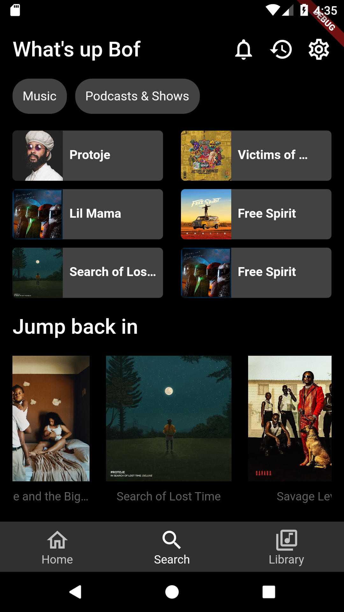
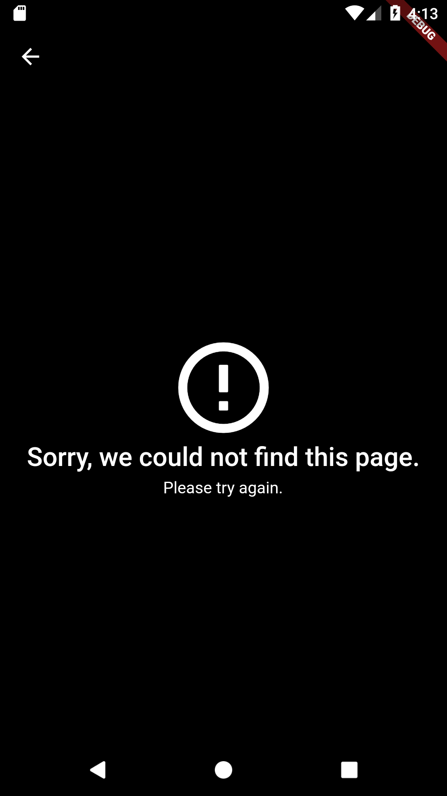
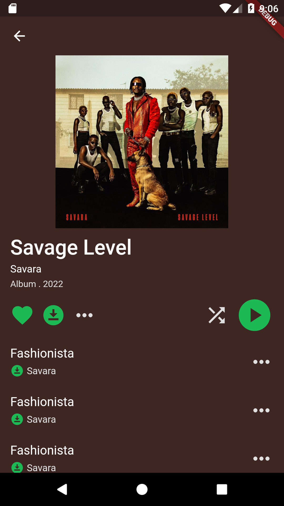
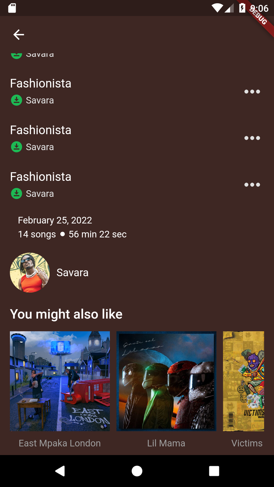
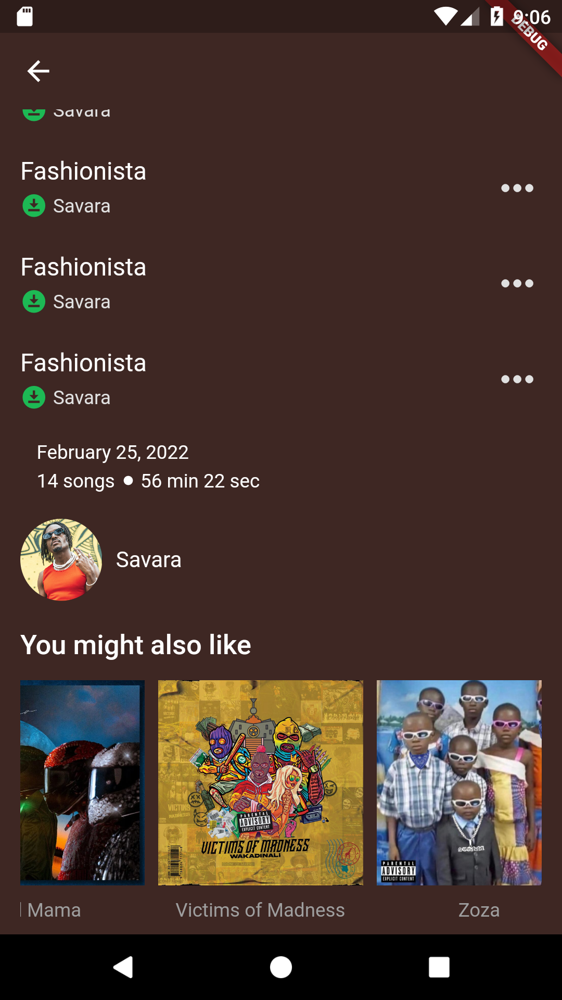

# Spotify Clone

This application clones the mobile UI of the Spotify app. It has no backend support hence cannot play music at this time. Future iteration might probably implement the backend and allow all the features Spotify has.

By Danroy Ndung'u

## Homepage

This page emulates the Spotify home page on iOS. However, the icons and the fonts used are not similar to those used in the Spotify application.

For code reusability, I have made custom widgets for the small tiles on the upper part of the home page as well as for the bigger tiles that are sectioned with a horizontal scroll.

## Error Page

## Album Details

